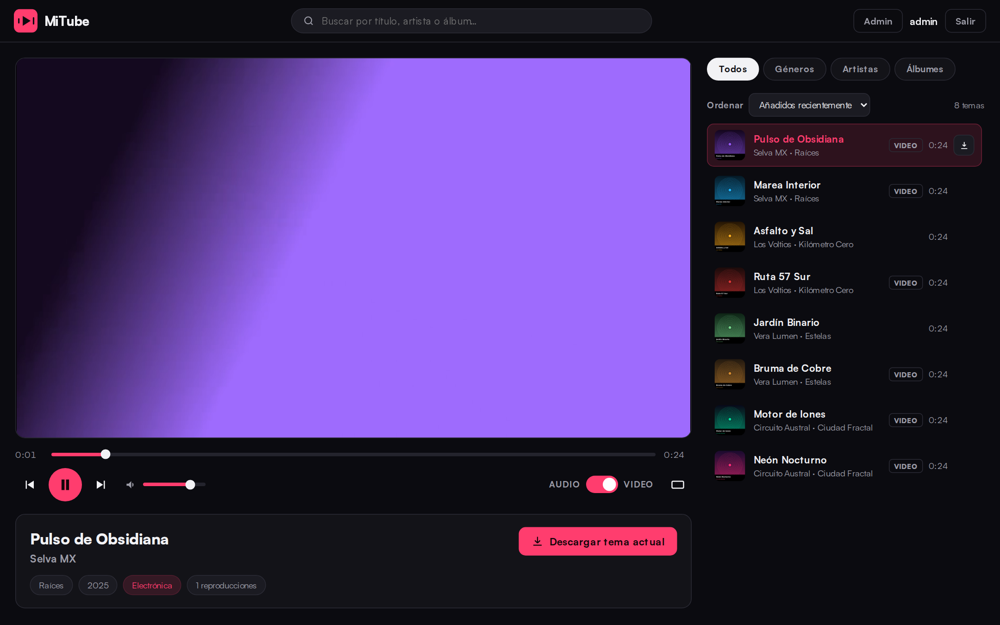
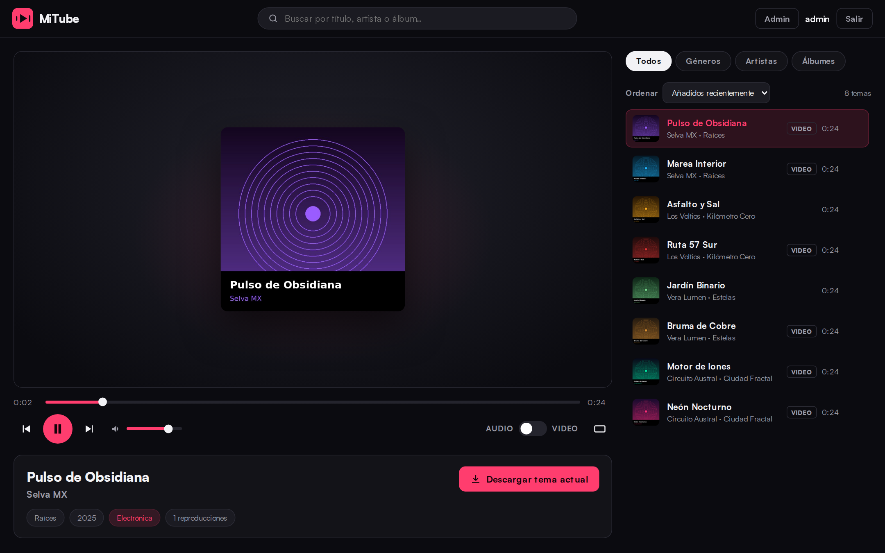
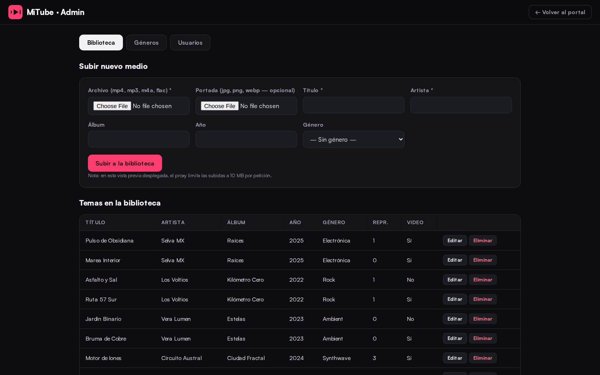
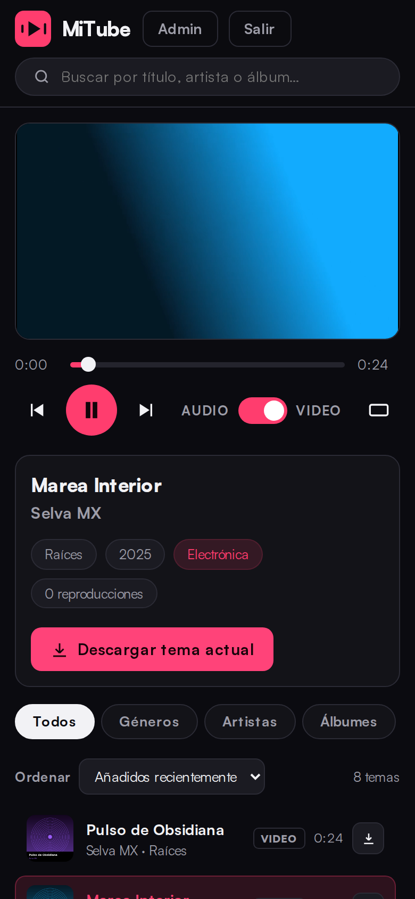

# MiTube — Media Portal (YouTube Music style)


**English** · [Español](README.md)

Responsive music and video playback portal featuring a **real-time Audio/Video switch**, cinema mode, autoplay queue, global search, downloads, and an admin panel. FastAPI + SQLite backend; vanilla HTML/CSS/JS dark-mode frontend.

## Screenshots

| Playing video | Audio mode (same track, no interruption) |
|---|---|
|  |  |

| Admin panel | Mobile |
|---|---|
|  |  |

## Requirements

- Python 3.11+
- FFmpeg and ffprobe on the PATH (`sudo apt install ffmpeg`)

## Install and run

```bash
cd media-portal
python -m venv .venv && source .venv/bin/activate
pip install -r requirements.txt

# 1. Create the initial admin (the DB initializes itself)
ADMIN_INITIAL_PASSWORD='YourSecureKey#2026' python seed.py
# If you omit the variable, a random password is generated and shown ONCE.

# 2. (Optional) Generate demo content
python make_samples.py

# 3. Start the server
python -m uvicorn server.main:app --host 0.0.0.0 --port 9000
```

Open `http://localhost:9000` in your browser.

## Bulk import (with modality merging)

```bash
python import_media.py /path/to/your/music --genre "Rock"
# or the preconfigured shortcut (videos first, then audio):
bash import_all.sh
```

It walks the folder recursively (videos first), validates every file (extension, magic bytes, ffprobe), skips duplicates via SHA-256 hash, extracts the audio rendition from videos, and reads metadata from file tags.

**Each song appears ONCE in the list** even if it exists in two files. Case-insensitive title+artist matching merges modalities:

| Situation | Result |
|---|---|
| A video arrives for a song that already exists audio-only | The video is **attached** to the track (original audio is kept) |
| The original audio arrives for a track whose audio was extracted from video | The original audio **replaces** the extracted one |
| The same modality arrives again | Discarded as duplicate (409 in the web UI) |
| Byte-identical file (hash) | Discarded as exact duplicate |

If your library consists of videos you extract audio from yourself, importing the video folder is enough: the portal extracts the audio automatically and both renditions share exactly the same track, so the Audio/Video switch flips with no perceptible drift. If you also import your extracted audio files, they merge without duplicating. The same logic applies to admin-panel uploads.

## Tests

With the server running:

```bash
ADMIN_INITIAL_PASSWORD='YourSecureKey#2026' python -m pytest tests/ -v
```

Coverage: register/login/logout, lockout after 5 failed attempts, 403 admin endpoints for regular users, Range Requests (206/416), Content-Disposition, LIKE escaping, SQL-injection attempts, magic-byte upload rejection, and admin-panel protections.

## Structure

```
media-portal/
├── server/            # FastAPI: main, database, security, media_processing, routers/
├── static/            # index.html, css/app.css, js/ (app, player, admin, api, ui)
├── media/             # video/, audio/, covers/ (UUID-named files)
├── tests/             # pytest
├── seed.py            # initial admin
├── import_media.py    # bulk import CLI
├── make_samples.py    # synthetic demo content
└── server/schema.sql  # SQLite schema (idempotent)
```

## Security features

- Passwords hashed with **argon2id**; strong policy validated in both frontend and backend.
- Server-side 256-bit sessions (SHA-256 stored in DB), 24 h sliding expiration, fresh token on every login (anti session-fixation), invalidation on logout and on user suspension.
- 15-minute account lockout after 5 failed attempts; generic error messages.
- 100% parameterized SQL; `LIKE` with `%`/`_` escaping; sort order via whitelist.
- Role-based authorization enforced in the backend on every admin endpoint (real 403, not just UI).
- **Public registration can be enabled/disabled** from the admin panel (Users tab): when disabled, the login screen hides "Create account" and the backend rejects registrations with 403; admins can still create accounts from the panel. Persisted in the `settings` table.
- Uploads: extension whitelist + **magic bytes** + ffprobe validation + UUID renaming + size limit + anti-duplicate hashing. FFmpeg always invoked with argument lists (never `shell=True`).
- Redundant anti path-traversal: clients only send IDs; DB paths are re-validated against `media/` with `Path.resolve()`.
- Rate limiting on login/registration/downloads; `X-Content-Type-Options`, `X-Frame-Options`, `Referrer-Policy` headers and CSP on HTML.
- Frontend never uses `innerHTML` with data (only `textContent`/`createElement`); friendly errors with technical detail kept in server logs only.

## Docker

Multi-architecture image (**amd64 and arm64** — works on Jetson/Raspberry Pi) published to GHCR on every push via GitHub Actions: `ghcr.io/barraman/mitube:latest`.

```bash
# Using the published image
mkdir -p data media
ADMIN_INITIAL_PASSWORD='YourKey#Secure' docker compose up -d

# Or building locally
docker compose up -d --build
```

- The DB persists in `./data/portal.db` (`MITUBE_DB` variable) and the library in `./media` — you can mount an NFS share from your NAS there.
- FFmpeg is pinned inside the image; no host dependencies.
- The container runs as an unprivileged user and exposes port **9000**.
- Bulk import inside the container: `docker exec -it mitube python import_media.py /app/media/inbox`.

## Production deployment with nginx

The `deploy/` directory ships ready-to-use configuration:

```bash
# 1. Install the project under /opt/mitube
sudo useradd -r -s /usr/sbin/nologin mitube
sudo mkdir -p /opt/mitube && sudo cp -r . /opt/mitube && cd /opt/mitube
sudo -u mitube python3 -m venv .venv
sudo -u mitube .venv/bin/pip install -r requirements.txt
sudo -u mitube ADMIN_INITIAL_PASSWORD='YourKey#Secure' .venv/bin/python seed.py

# 2. Import your library (as your own user, with access to your folders)
python import_media.py ~/inventario/multimedia/video
python import_media.py ~/inventario/multimedia/audio
sudo chown -R mitube:mitube /opt/mitube/media /opt/mitube/portal.db*

# 3. systemd service
sudo cp deploy/mitube.service /etc/systemd/system/
sudo systemctl daemon-reload && sudo systemctl enable --now mitube

# 4. nginx + HTTPS
sudo cp deploy/nginx-mitube.conf /etc/nginx/sites-available/mitube.conf
# Edit server_name and root in the file, then:
sudo ln -s /etc/nginx/sites-available/mitube.conf /etc/nginx/sites-enabled/
sudo apt install certbot python3-certbot-nginx && sudo certbot --nginx -d mitube.yourdomain.com
sudo nginx -t && sudo systemctl reload nginx
```

Details already handled by the shipped configuration:

- nginx serves `static/` directly and proxies `/api/` to uvicorn at `127.0.0.1:9000` (uvicorn is never exposed).
- `proxy_buffering off` + `proxy_request_buffering off`: Range-Request streaming and uploads flow without disk buffering.
- `client_max_body_size 512m` for admin uploads (the app limit is 500 MB).
- `--proxy-headers --forwarded-allow-ips 127.0.0.1` on uvicorn: rate limiting sees the real client IP via `X-Forwarded-For`.
- HSTS, `nosniff`, `X-Frame-Options` and `Referrer-Policy` at the nginx level; the frontend session cookie adds the `Secure` flag automatically under HTTPS.
- Hardened systemd unit: unprivileged user, `NoNewPrivileges`, `ProtectSystem=full`, `PrivateTmp`.

## fail2ban (extra layer on top of nginx)

The `deploy/fail2ban/` directory includes ready-made filters and jails:

```bash
sudo apt install fail2ban
sudo cp deploy/fail2ban/filter.d/*.conf /etc/fail2ban/filter.d/
sudo cp deploy/fail2ban/jail.d/mitube.local /etc/fail2ban/jail.d/
# Adjust ignoreip in mitube.local to your local network before reloading
sudo fail2ban-client reload
sudo fail2ban-client status mitube-auth
```

Included jails:

- **mitube-auth**: brute force against `/api/auth/login|register` (401/423/429 responses). 8 attempts in 10 min → 1 h ban, incremental up to 1 week. Complements the app's account lockout: the app protects the account, fail2ban cuts the IP at the firewall.
- **mitube-probe**: API scanning — bursts of 403 on `/api/admin` (panel probing) and 404 on `/api/` (route enumeration). 20 in 5 min → 30 min ban.
- **recidive**: repeat offenders from any jail → 1-week ban on all ports.

Filters are validated against nginx's default `combined` log format. To test them against your real log: `sudo fail2ban-regex /var/log/nginx/access.log /etc/fail2ban/filter.d/mitube-auth.conf`.

## Preview environment notes

- In the deployed preview of this environment, the proxy limits uploads to 10 MB per request and authentication uses Bearer tokens (sandboxed iframes block cookies).
